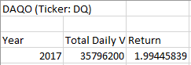

# stock-analysis

## Overview

This project was done to help Steve with analyzing the given stocks for years 2017, and 2018, by automating the analysis by clicking a button. Once the year 2017 or 2018 is typed, VBA code in the background runs analysis on the data, and outputs the data to a new worksheet, and formats the output as shown below.

## Analysis of the data

Steve's parents wanted to find out how the stock with ticker DQ's yearly return was for 2018. Analyzing the data showed us stock DQ did good in year 2017 with 35.8 million traded with 199.4% yearly return, and very badly in year 2018 with 107.9 million traded with -62.6% yearly return, as shown below.

Steve decided to analyze all the stocks given in the data set and suggest better stocks based on their performance in 2018, and 2017. So, further analysis of the data showed us that it is better to pick couple of different stocks like ENPH, and RUN. ENPH did well both years with yearly returns of 129.5% (2017), and 81.9% (2018). RUN did well both years too with yearly returns of 5.5% (2017), and 84% (2018) respectively.

## Recommendation for Steve's parents

From the data analyzed it would be better if Steve's parents invest in stocks ENPH, and RUN as opposed to DQ.

## Code analysis

Furthermore code was refactored, from the original code to improve performance. Before the code was refactored, total time to complete analysis and formatting took 0.824 seconds for the year 2017. After refactoring the code, total time to complete analysis and formatting reduced by a factor of 5 to 0.156 seconds, for the year 2017.

Similar results were observed for year 2018 data analysis as well.

### Refactoring code
Refactoring of the code not only helps in improving performace, it also helps in readability and maintainability of the code. With properly named variables it is easier for someone to understand the code in future. The drawbacks I see in refactoring code are, it is very time consuming, and also there is a chance of introducing new bugs.

### Refactoring this project's code
For the given code refactoring helped in improving the total time it took to analyze the code as follows. Before refactoring, we were looping through the whole data set for each ticker and that is going through the whole dataset 12 times. However after refactoring the code, we were going through the whole dataset just once and that is definitely better and faster. 

